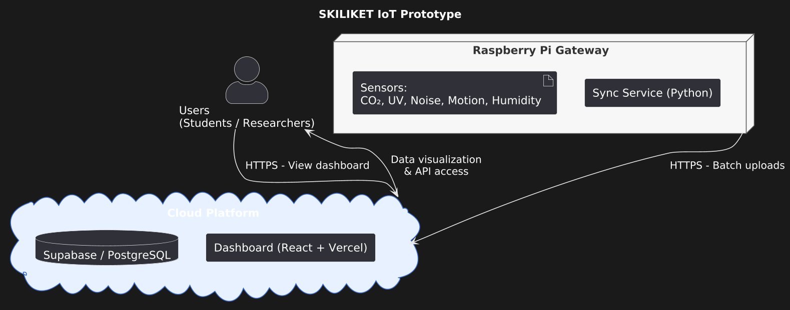
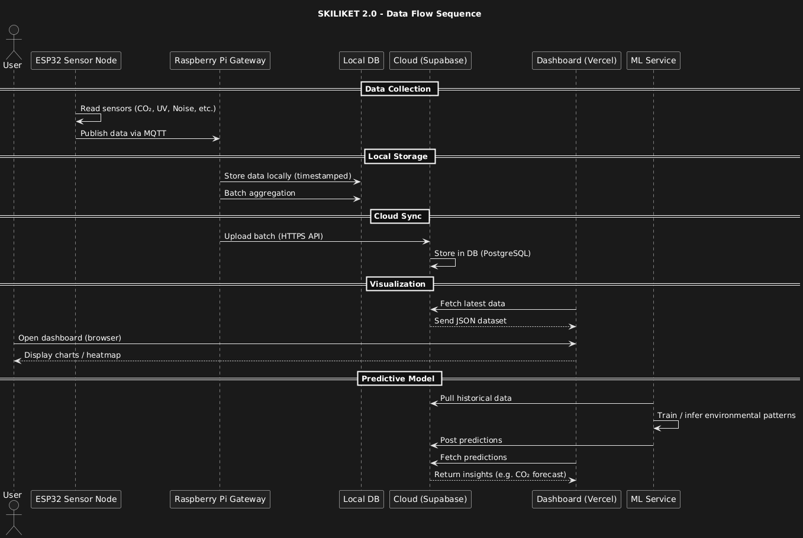
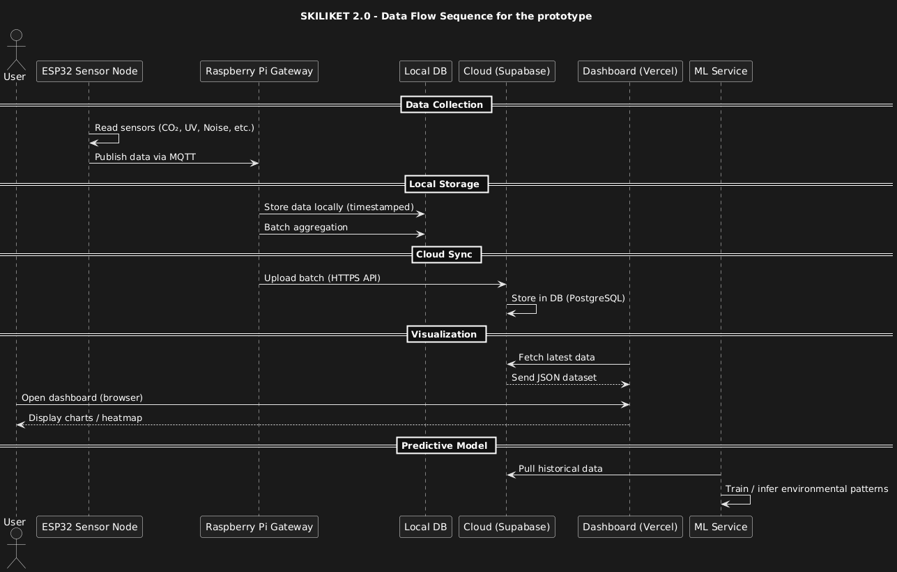

# Skiliket IoT System

A full-stack IoT + AI platform for monitoring and modeling environmental conditions in urban regions.
This repository serves as the **main entry point** and documentation hub for the entire system architecture.

---

## Overview

**Skiliket IoT System** is a distributed, scalable platform designed to:

* Collect environmental data from field-deployed IoT nodes
* Clean, preprocess and upload data through an intelligent edge gateway
* Store structured data in a cloud-hosted database
* Visualize real-time and historical measurements through a web dashboard
* Train machine learning models to predict environmental dynamics

The platform is composed of two main repositories:

1. **Gateway, Simulation Engine & ML Pipeline**
   [Skiliket-RPI4](https://github.com/andresaugom/Skiliket-RPI4)

2. **Web Dashboard for Real-Time & Historical Visualization**
   [Skiliket-Dashboard](https://github.com/andresaugom/Skiliket-Dashboard)

This repository ties all components together and documents the **end-to-end architecture**.

---

## System Architecture

The system follows a **clear modular architecture**:

```
[IoT Node (ESP32 + sensors)]
           ↓ (MQTT, 15s samples)
[Raspberry Pi 4 Gateway]
    - preprocessing (5-min avg)
    - validation & cleaning
    - uplink to Supabase
           ↓
[Supabase (PostgreSQL)]
           ↓
[Dashboard Web App]
           ↓
[ML Models & Prediction API]
```

### Architecture Diagram

The proposed architecture consists of: 


And the prototype implementation: 



---

## Components

### 1. **Skiliket-RPI4 — Gateway, Simulation & Machine Learning**

Repository [here](https://github.com/andresaugom/Skiliket-RPI4).

This component handles all backend intelligence:

#### **Data Ingestion & Edge Processing**

* Receives measurements from ESP32 nodes:

  * **CO₂**, **UV**, **noise**, **temperature**, **humidity**
* Raw samples every **15 seconds**
* Applies **5-minute moving average**
* Validates and uploads cleaned data to **Supabase**

#### **Simulation Engine**

* Generates large synthetic datasets modeling realistic sensor behavior
* Feeds a parallel Supabase schema for ML model training

#### **Machine Learning Pipeline**

* Random Forest regressors trained per variable
* Current model performance (MAE):

  * UV: **0.04**
  * CO₂: **36.4**
  * Temperature: **0.64**
  * Noise: **2.31**
  * Humidity: **2.66**

### 2. **Skiliket-Dashboard — Real-Time & Historical Visualization**

Repository [here](https://github.com/andresaugom/Skiliket-Dashboard).

Key capabilities:

* Near–real-time environmental monitoring
* Historical charts + trends
* CSV export for scientific work
* Clean interface built with **Next.js + Supabase client**
* Interpreted indicators (CO₂ zones, comfort levels, etc.)

---

## Deployment Overview

The system is built to be replicable with minimal configuration:

### Deployment steps

Ensure you have this connections: 

#### I²C Bus (SCL/SDA)
- **AHT20 (Temp/Humidity)**  
  - SCL → Board SCL  
  - SDA → Board SDA  
  - Power → 3.3V / GND

- **ENS160 (Air Quality: eCO2, TVOC, AQI)**  
  - SCL → Board SCL  
  - SDA → Board SDA  
  - Power → 3.3V / GND

#### Audio Input
- **USB Microphone**  
  - Auto-detected by PyAudio  
  - No GPIO pins used

## Power Notes
- Sensors on I²C: 3.3V  
- LCD and PIR: 5V  
- All grounds should be common.

---

## Features

* **Modern, modular IoT architecture**
* **End-to-end ML workflow** (simulation → training → evaluation → predictions)
* **Edge intelligence** on Raspberry Pi
* **Supabase integration** (PostgreSQL + Auth)
* **Real-time and historical dashboard**
* **Scalable design** ready for multiple nodes in an urban grid
* **Sensor suite focused on environmental quality**

  * CO₂
  * UV
  * Noise
  * Temperature
  * Humidity

---

## Getting Started

To deploy the full system:

1. Clone the repository on the Raspberry Pi prototype:

```sh
git clone https://github.com/andresaugom/Skiliket-RPI4.git
cd Skiliket-RPI4/
```

and install all the necessary for the python scripts:

```sh
pip install -r requirements.txt
```

Optionally, you can use a Virtual Environment for the setup:

```sh
pyenv local 3.9 // For the guaranteed python version working in this project
python -m venv venv
source venv/bin/activate
pip install -r requirements.txt
```

Then, to start measuring: 

```sh
python3 firmware/main.py
```

2. Clone the repository for the Dashboard (optional)

```sh
git clone https://github.com/andresaugom/Skiliket-Dashboard.git
cd Skiliket-Dashboard/
```

and install all the necessary for the project:

```sh
npm install --save-dev
```

To run the web host: 

```sh 
npm run dev
```

And everything is ready to be tested.

---

## Use Cases

* Urban & citizen science environmental monitoring
* Indoor air quality & smart buildings
* UV exposure tracking
* University research / academic deployments
* Data analysis & environmental prediction studies

---

## Data Flow

The proposed data flow consists of: 



The prototype implementation data flow is:



## Contributing

To contribute to specific modules:

* Gateway & ML pipeline → **Skiliket-RPI4**
* Dashboard & visualization → **Skiliket-Dashboard**

Open issues or pull requests in the appropriate repository.

---

## License

Refer to each component repository for license details.

